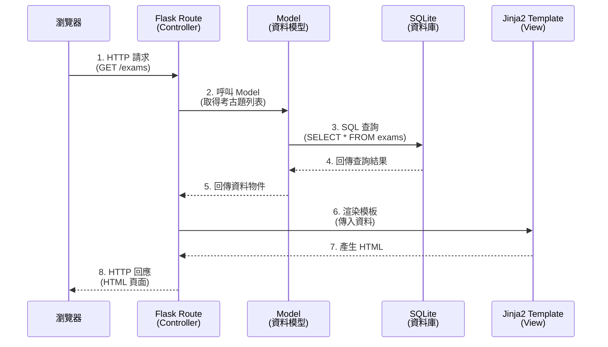
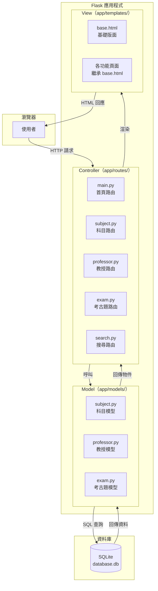

# 系統架構設計 — 考古題收藏系統

## 1. 技術架構說明

### 1.1 選用技術與原因

| 技術         | 角色         | 選用原因                                                       |
| ------------ | ------------ | -------------------------------------------------------------- |
| **Python**   | 程式語言     | 語法簡潔易讀，適合初學者快速上手                               |
| **Flask**    | 後端框架     | 輕量級微框架，核心精簡但可擴充，適合中小型專案                 |
| **Jinja2**   | 模板引擎     | Flask 內建模板引擎，可在 HTML 中嵌入 Python 邏輯，產生動態頁面 |
| **SQLite**   | 資料庫       | 輕量級嵌入式資料庫，無需安裝伺服器，單一檔案即可運作           |
| **HTML/CSS/JS** | 前端技術  | 瀏覽器原生支援，搭配 Jinja2 渲染動態內容                       |

### 1.2 Flask MVC 模式說明

本專案採用 **MVC（Model-View-Controller）** 架構模式：

```
┌─────────────────────────────────────────────────────────────┐
│                        MVC 架構                              │
├─────────────┬─────────────────┬─────────────────────────────┤
│   Model     │   View          │   Controller                │
│  (資料模型)  │  (視覺呈現)      │  (邏輯控制)                  │
├─────────────┼─────────────────┼─────────────────────────────┤
│ app/models/ │ app/templates/  │ app/routes/                 │
│             │                 │                             │
│ 負責：       │ 負責：           │ 負責：                       │
│ • 定義資料表 │ • HTML 頁面結構  │ • 接收 HTTP 請求             │
│ • 資料的     │ • 使用 Jinja2    │ • 呼叫 Model 操作資料        │
│   CRUD 操作  │   動態渲染資料   │ • 選擇要渲染的 Template      │
│ • 與 SQLite  │ • 表單元件       │ • 處理表單提交               │
│   資料庫互動 │ • 排版與樣式     │ • 回傳 HTTP 回應             │
└─────────────┴─────────────────┴─────────────────────────────┘
```

**資料流程：**
1. 使用者在瀏覽器發出請求（例如：瀏覽考古題列表）
2. **Controller**（Flask Route）接收請求，決定要做什麼
3. Controller 呼叫 **Model** 從資料庫取得資料
4. Controller 將資料傳給 **View**（Jinja2 Template）渲染成 HTML
5. 瀏覽器收到 HTML 並顯示給使用者

---

## 2. 專案資料夾結構

```
web_app_development/
│
├── app.py                    ← 應用程式入口，啟動 Flask 伺服器
├── config.py                 ← 設定檔（資料庫路徑、Secret Key 等）
├── requirements.txt          ← Python 套件相依清單
│
├── app/                      ← 主要應用程式目錄
│   ├── __init__.py           ← Flask App 工廠函式（create_app）
│   │
│   ├── models/               ← Model 層：資料庫模型
│   │   ├── __init__.py
│   │   ├── subject.py        ← 科目模型（Subject）
│   │   ├── professor.py      ← 教授模型（Professor）
│   │   └── exam.py           ← 考古題模型（Exam）
│   │
│   ├── routes/               ← Controller 層：Flask 路由
│   │   ├── __init__.py
│   │   ├── main.py           ← 首頁與通用路由
│   │   ├── subject.py        ← 科目相關路由（CRUD）
│   │   ├── professor.py      ← 教授相關路由（CRUD）
│   │   ├── exam.py           ← 考古題相關路由（CRUD + 搜尋）
│   │   └── search.py         ← 搜尋功能路由
│   │
│   ├── templates/            ← View 層：Jinja2 HTML 模板
│   │   ├── base.html         ← 基礎版面（共用的 header/footer/nav）
│   │   ├── index.html        ← 首頁
│   │   ├── subjects/         ← 科目相關頁面
│   │   │   ├── list.html     ← 科目列表
│   │   │   ├── detail.html   ← 科目詳情（含該科目考古題）
│   │   │   └── form.html     ← 新增/編輯科目表單
│   │   ├── professors/       ← 教授相關頁面
│   │   │   ├── list.html     ← 教授列表
│   │   │   ├── detail.html   ← 教授詳情（含該教授考古題）
│   │   │   └── form.html     ← 新增/編輯教授表單
│   │   ├── exams/            ← 考古題相關頁面
│   │   │   ├── list.html     ← 考古題列表
│   │   │   ├── detail.html   ← 考古題詳情
│   │   │   └── form.html     ← 新增/編輯考古題表單
│   │   └── search/           ← 搜尋相關頁面
│   │       └── results.html  ← 搜尋結果頁面
│   │
│   └── static/               ← 靜態資源
│       ├── css/
│       │   └── style.css     ← 全站樣式表
│       └── js/
│           └── main.js       ← 全站 JavaScript
│
├── database/                 ← 資料庫相關
│   └── schema.sql            ← 建表 SQL 語法
│
├── instance/                 ← Flask 實例資料夾（自動產生）
│   └── database.db           ← SQLite 資料庫檔案
│
├── docs/                     ← 設計文件
│   ├── PRD.md                ← 產品需求文件
│   └── ARCHITECTURE.md       ← 系統架構文件（本文件）
│
└── .agents/                  ← AI Agent Skills（課程提供）
    └── skills/
```

### 各目錄職責說明

| 目錄/檔案        | 職責                                                           |
| ---------------- | -------------------------------------------------------------- |
| `app.py`         | 程式進入點，呼叫 `create_app()` 並啟動開發伺服器              |
| `config.py`      | 集中管理設定值（資料庫路徑、DEBUG 模式、SECRET_KEY）           |
| `app/__init__.py`| 使用 App Factory 模式建立 Flask 應用程式實體，註冊 Blueprint   |
| `app/models/`    | 定義資料表結構與資料操作函式（新增、查詢、修改、刪除）         |
| `app/routes/`    | 定義 URL 路徑與對應的處理函式，使用 Blueprint 模組化管理       |
| `app/templates/` | Jinja2 HTML 模板，使用模板繼承減少重複程式碼                   |
| `app/static/`    | 靜態檔案（CSS、JavaScript），瀏覽器直接載入                    |
| `database/`      | 存放 SQL schema，方便重建資料庫                                |
| `instance/`      | 存放 SQLite 資料庫檔案，不納入版本控制                         |

---

## 3. 元件關係圖

### 3.1 請求處理流程



### 3.2 系統架構總覽



---

## 4. 關鍵設計決策

### 決策 1：使用 App Factory 模式

**選擇：** 在 `app/__init__.py` 中使用 `create_app()` 函式建立 Flask 應用程式

**原因：**
- 方便進行測試（可建立不同設定的 app 實體）
- 避免循環引用問題
- 是 Flask 官方推薦的最佳實踐

### 決策 2：使用 Blueprint 模組化路由

**選擇：** 每個功能（科目、教授、考古題、搜尋）各自有獨立的 Blueprint

**原因：**
- 各功能的程式碼互不干擾，方便分工開發
- 每位組員可以專注在自己負責的 Blueprint
- URL 前綴管理清晰（如 `/subjects/`、`/professors/`、`/exams/`）

### 決策 3：使用原生 sqlite3 而非 ORM

**選擇：** 直接使用 Python 內建的 `sqlite3` 模組操作資料庫

**原因：**
- 減少學習額外套件（SQLAlchemy）的負擔
- 直接撰寫 SQL 更容易理解資料庫操作原理
- 專案規模小，ORM 的優勢不明顯

### 決策 4：使用 Jinja2 模板繼承

**選擇：** 建立 `base.html` 作為基礎版面，其他頁面透過 `` 繼承

**原因：**
- 導覽列、頁尾等共用元素只需寫一次
- 修改共用樣式只需改一個檔案
- 保持各頁面模板的簡潔

### 決策 5：表單處理採用 POST/Redirect/GET 模式

**選擇：** 表單提交後使用 `redirect()` 重新導向，避免重複提交

**原因：**
- 防止使用者重新整理頁面時重複提交表單
- 是 Web 開發的標準最佳實踐
- 提供更好的使用者體驗

---

*文件產出日期：2026-04-28*
*文件版本：v1.0*
