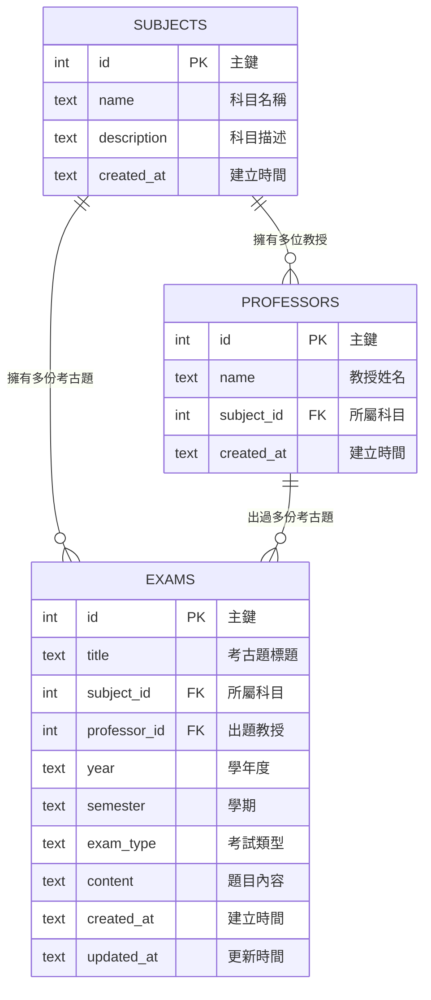

# 資料庫設計 — 考古題收藏系統

## 1. ER 圖（實體關係圖）

### 關聯說明

| 關聯                    | 類型   | 說明                                 |
| ----------------------- | ------ | ------------------------------------ |
| SUBJECTS → PROFESSORS   | 一對多 | 一個科目可以有多位教授授課           |
| SUBJECTS → EXAMS        | 一對多 | 一個科目可以有多份考古題             |
| PROFESSORS → EXAMS      | 一對多 | 一位教授可以出過多份考古題           |

---

## 2. 資料表詳細說明

### 2.1 subjects（科目表）

| 欄位        | 型別    | 必填 | 說明                                  |
| ----------- | ------- | ---- | ------------------------------------- |
| id          | INTEGER | 自動 | 主鍵，自動遞增                        |
| name        | TEXT    | ✅   | 科目名稱（如：微積分、線性代數）      |
| description | TEXT    | ❌   | 科目描述                              |
| created_at  | TEXT    | 自動 | 建立時間（ISO 8601 格式）             |

### 2.2 professors（教授表）

| 欄位        | 型別    | 必填 | 說明                                  |
| ----------- | ------- | ---- | ------------------------------------- |
| id          | INTEGER | 自動 | 主鍵，自動遞增                        |
| name        | TEXT    | ✅   | 教授姓名                              |
| subject_id  | INTEGER | ❌   | 外鍵，關聯到 subjects.id              |
| created_at  | TEXT    | 自動 | 建立時間（ISO 8601 格式）             |

### 2.3 exams（考古題表）

| 欄位         | 型別    | 必填 | 說明                                    |
| ------------ | ------- | ---- | --------------------------------------- |
| id           | INTEGER | 自動 | 主鍵，自動遞增                          |
| title        | TEXT    | ✅   | 考古題標題                              |
| subject_id   | INTEGER | ✅   | 外鍵，關聯到 subjects.id                |
| professor_id | INTEGER | ✅   | 外鍵，關聯到 professors.id              |
| year         | TEXT    | ✅   | 學年度（如：113、112）                  |
| semester     | TEXT    | ✅   | 學期（1 或 2）                          |
| exam_type    | TEXT    | ✅   | 考試類型（期中考、期末考、小考）        |
| content      | TEXT    | ✅   | 題目內容（純文字）                      |
| created_at   | TEXT    | 自動 | 建立時間（ISO 8601 格式）               |
| updated_at   | TEXT    | 自動 | 最後更新時間（ISO 8601 格式）           |

---

## 3. SQL 建表語法

完整的建表語法已儲存於 `database/schema.sql`，請參考該檔案。

---

## 4. Python Model 程式碼

每個資料表對應一個 Model 檔案，放在 `app/models/` 目錄下：

| 資料表     | Model 檔案              | 說明                                  |
| ---------- | ----------------------- | ------------------------------------- |
| subjects   | `app/models/subject.py` | 科目的 CRUD 操作                      |
| professors | `app/models/professor.py` | 教授的 CRUD 操作                    |
| exams      | `app/models/exam.py`    | 考古題的 CRUD 操作 + 搜尋功能         |

每個 Model 都提供以下方法：
- `create()` — 新增一筆資料
- `get_all()` — 取得所有資料
- `get_by_id(id)` — 依 ID 取得單筆資料
- `update(id, data)` — 更新一筆資料
- `delete(id)` — 刪除一筆資料

---

*文件產出日期：2026-04-28*
*文件版本：v1.0*
