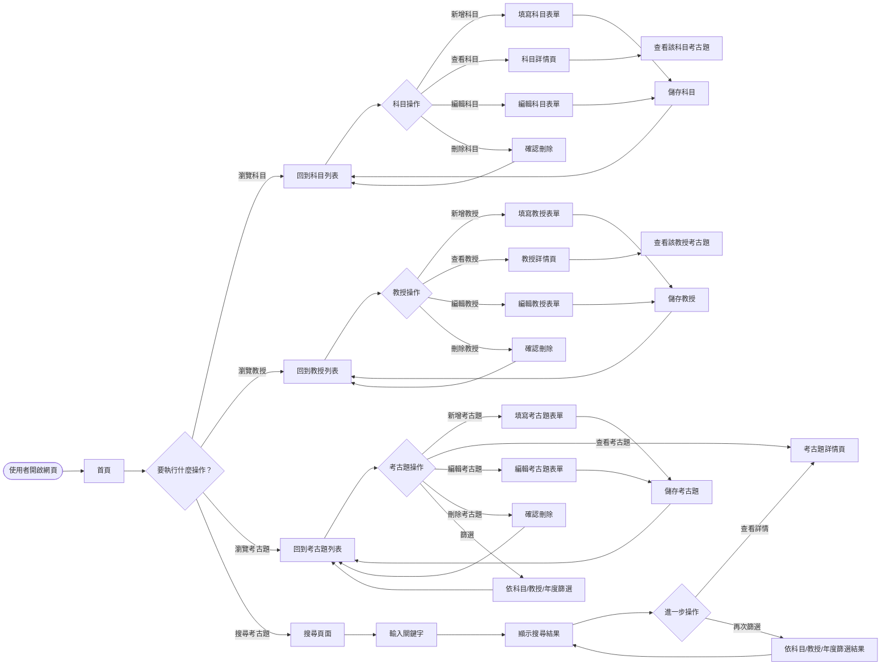
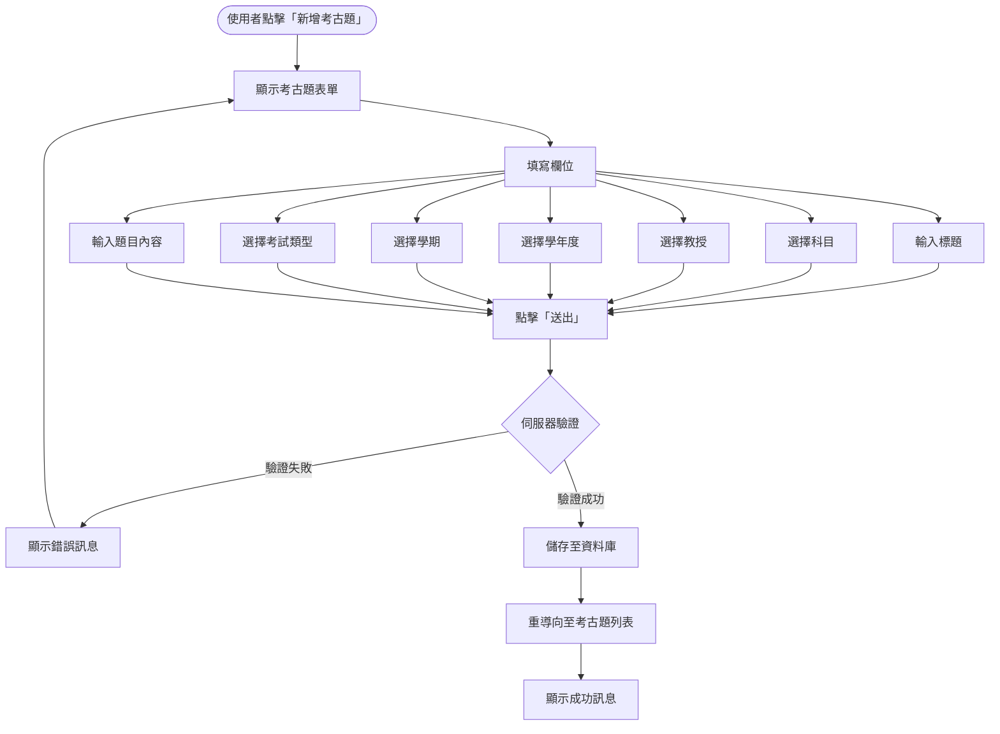
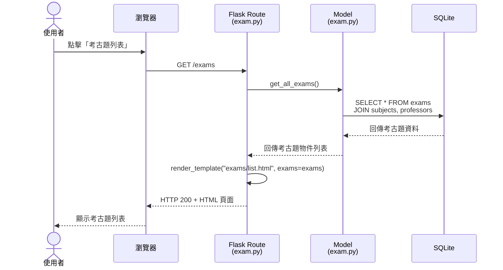
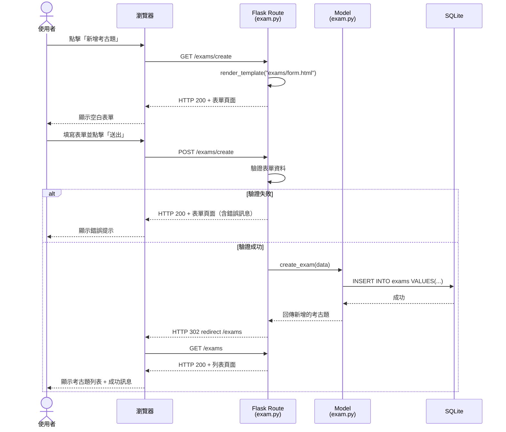
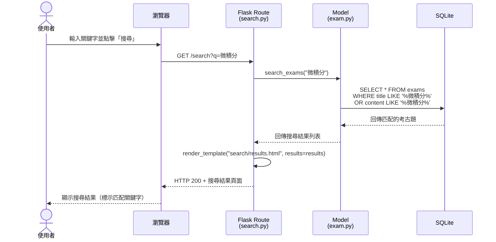
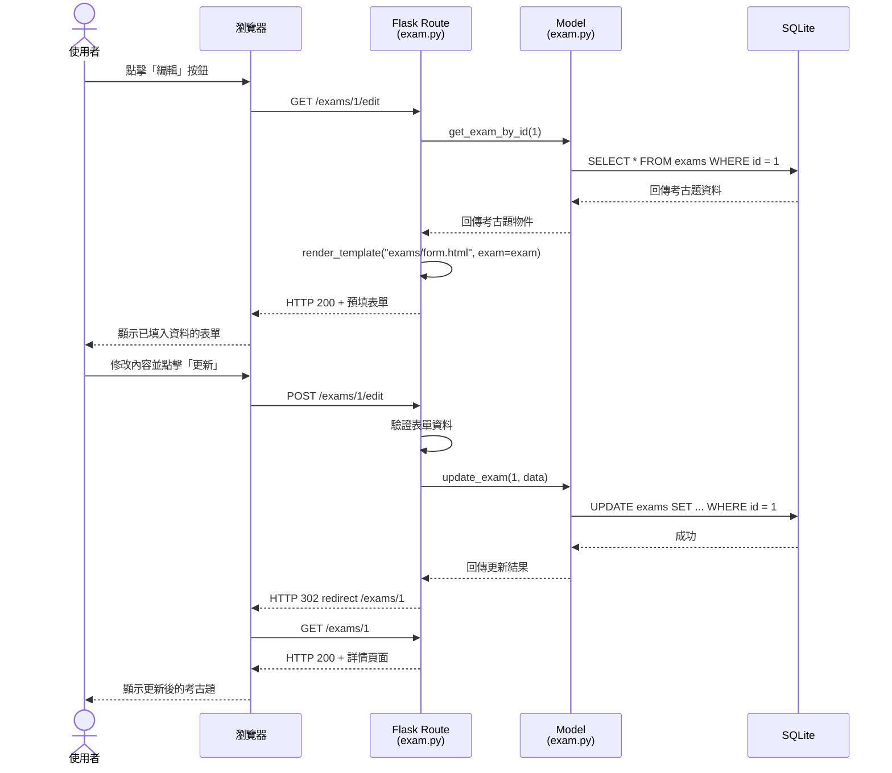
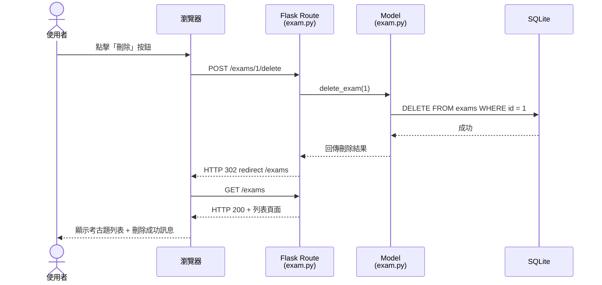

# 流程圖設計 — 考古題收藏系統

## 1. 使用者流程圖（User Flow）

以下流程圖描述使用者進入網站後的所有操作路徑。

### 1.1 主要操作流程

### 1.2 考古題新增流程（詳細版）

---

## 2. 系統序列圖（Sequence Diagram）

### 2.1 瀏覽考古題列表

### 2.2 新增考古題

### 2.3 搜尋考古題

### 2.4 編輯考古題

### 2.5 刪除考古題

---

## 3. 功能清單對照表

| 功能             | URL 路徑              | HTTP 方法 | 說明                       |
| ---------------- | --------------------- | --------- | -------------------------- |
| 首頁             | `/`                   | GET       | 顯示系統首頁與統計資訊     |
| 科目列表         | `/subjects`           | GET       | 顯示所有科目               |
| 新增科目         | `/subjects/create`    | GET/POST  | 顯示表單 / 處理新增        |
| 科目詳情         | `/subjects/<id>`      | GET       | 顯示科目資訊與相關考古題   |
| 編輯科目         | `/subjects/<id>/edit` | GET/POST  | 顯示編輯表單 / 處理更新    |
| 刪除科目         | `/subjects/<id>/delete` | POST    | 處理刪除科目               |
| 教授列表         | `/professors`         | GET       | 顯示所有教授               |
| 新增教授         | `/professors/create`  | GET/POST  | 顯示表單 / 處理新增        |
| 教授詳情         | `/professors/<id>`    | GET       | 顯示教授資訊與相關考古題   |
| 編輯教授         | `/professors/<id>/edit` | GET/POST | 顯示編輯表單 / 處理更新    |
| 刪除教授         | `/professors/<id>/delete` | POST  | 處理刪除教授               |
| 考古題列表       | `/exams`              | GET       | 顯示所有考古題（可篩選）   |
| 新增考古題       | `/exams/create`       | GET/POST  | 顯示表單 / 處理新增        |
| 考古題詳情       | `/exams/<id>`         | GET       | 顯示考古題完整內容         |
| 編輯考古題       | `/exams/<id>/edit`    | GET/POST  | 顯示編輯表單 / 處理更新    |
| 刪除考古題       | `/exams/<id>/delete`  | POST      | 處理刪除考古題             |
| 搜尋考古題       | `/search`             | GET       | 依關鍵字搜尋考古題         |

---

*文件產出日期：2026-04-28*
*文件版本：v1.0*
